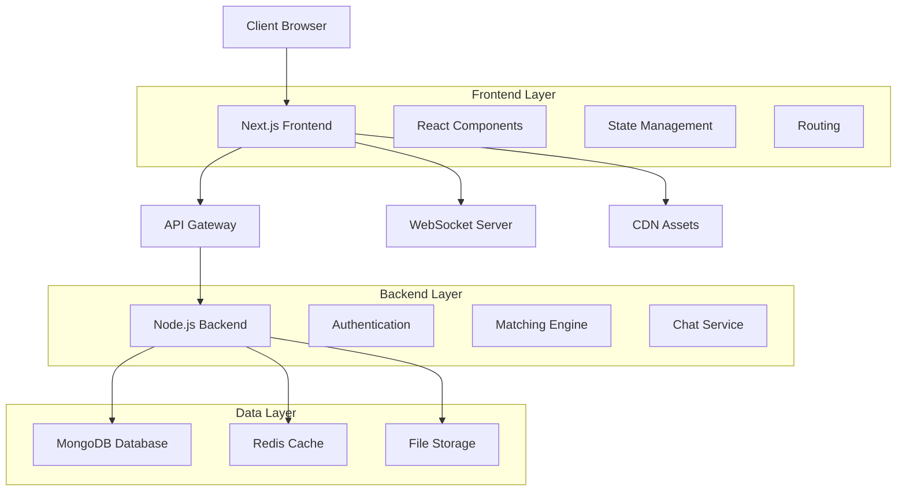
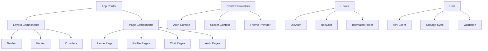

# 💕 Soulara - Modern Dating Platform

<div align="center">
  
  
  [](https://nextjs.org/)
  [](https://reactjs.org/)
  [](https://www.typescriptlang.org/)
  [](https://tailwindcss.com/)
  []()
  
  **A soul-focused dating platform built with modern web technologies**
  
  [Live Demo](https://soulara.app) • [Backend Repo](../backend/README.md) • [Contributing](#contributing) • [API Docs](#api-integration)
</div>

## 📋 Table of Contents

- [🌟 Overview](#-overview)
- [✨ Features](#-features)
- [🛠️ Technology Stack](#️-technology-stack)
- [📁 Project Structure](#-project-structure)
- [🚀 Getting Started](#-getting-started)
- [💻 Development](#-development)
- [🎨 Design System](#-design-system)
- [🔌 API Integration](#-api-integration)
- [🚀 Deployment](#-deployment)
- [🧪 Testing](#-testing)
- [🤝 Contributing](#-contributing)
- [📄 License](#-license)

## 🌟 Overview

Soulara is a modern dating platform that focuses on meaningful connections through personality compatibility, spiritual alignment, and soul-level matching. Built with Next.js 15, TypeScript, and a comprehensive design system.

### Key Features at a Glance
- 🧠 **OCEAN Personality Assessment** - Scientific personality matching
- 💕 **Advanced Matching System** - Like, pass, super like with confetti celebrations
- 🔍 **Real-time Search** - Find users instantly with debounced search
- 💬 **Live Chat** - WebSocket-based real-time messaging
- 🎊 **Celebration Effects** - Confetti animations for matches and likes
- 📱 **Progressive Web App** - Native-like mobile experience

## ✨ Features

### 🔐 Authentication & Security
- **Multi-provider Authentication** (Email, Social Login)
- **JWT Token Management** with automatic refresh
- **Protected Routes** with Next.js middleware
- **Session Management** with persistent storage

### 👤 Profile Management
- **Comprehensive Profile Builder** with step-by-step guidance
- **Photo Upload & Management** with image optimization
- **OCEAN Personality Assessment** (10 questions, 5 traits)
- **Privacy Controls** and visibility settings

### 💕 Matching System
- **Smart Matching Algorithm** based on compatibility scores
- **Interactive Swipe Interface** with smooth animations
- **Like/Pass/Super Like** functionality
- **Match Celebration** with confetti effects using react-confetti
- **Real-time Match Notifications** with toast feedback

### 🔍 Search & Discovery
- **Real-time User Search** with debounced API calls
- **Advanced Filtering** by age, location, interests
- **Quick Actions** from search results (like/pass buttons)
- **AI-Recommended Matches** carousel

### 💬 Chat System
- **Real-time Messaging** with Socket.io
- **Message Status Indicators** (sent, delivered, read)
- **Typing Indicators** and online status
- **Chat History** with pagination

### 📊 Dashboard & Analytics
- **Matches Dashboard** with comprehensive tabs:
  - Mutual Matches
  - Likes Received
  - Match History
- **Statistics Overview** with match counts
- **User Activity Tracking**

## 🛠️ Technology Stack

### Frontend Core
| Technology | Version | Purpose |
|------------|---------|---------|
| **Next.js** | 15.5.2 | React framework with App Router |
| **React** | 18.3.1 | UI library |
| **TypeScript** | 5.0+ | Type-safe JavaScript |
| **Tailwind CSS** | 4.0+ | Utility-first CSS framework |

### UI & Design
| Technology | Purpose |
|------------|---------|
| **shadcn/ui** | Pre-built accessible components |
| **Radix UI** | Headless UI primitives |
| **Lucide React** | Modern icon library |
| **Framer Motion** | Smooth animations |
| **react-confetti** | Celebration effects |

### State & Data Management
| Technology | Purpose |
|------------|---------|
| **React Context** | Global state management |
| **Custom Hooks** | Reusable stateful logic |
| **Socket.io Client** | Real-time communication |
| **Sonner** | Toast notifications |

### Development Tools
| Tool | Purpose |
|------|---------|
| **ESLint** | Code linting and quality |
| **TypeScript** | Static type checking |
| **Turbopack** | Fast development bundling |

## 📁 Project Structure

```
frontend/
├── 📄 README.md                     # Project documentation
├── 📄 package.json                  # Dependencies and scripts
├── 📄 tailwind.config.js            # Tailwind configuration
├── 📄 next.config.ts                # Next.js configuration
├── 📄 tsconfig.json                 # TypeScript configuration
├── 📄 middleware.ts                 # Authentication middleware
├── 📁 public/                       # Static assets
│   ├── 📁 assets/                   # Images and media
│   └── 📄 favicon.ico               # Site icon
└── 📁 src/                          # Source code
    ├── 📁 app/                      # Next.js App Router
    │   ├── 📄 layout.tsx            # Root layout with providers
    │   ├── 📄 page.tsx              # Landing page
    │   ├── 📄 globals.css           # Global styles and variables
    │   ├── 📁 (auth)/               # Authentication routes
    │   │   ├── 📁 login/            # Login page
    │   │   └── 📁 signup/           # Registration page
    │   └── 📁 (main)/               # Main app (authenticated)
    │       ├── 📄 layout.tsx        # Main app layout
    │       ├── 📄 page.tsx          # Dashboard/Home
    │       ├── 📁 _components/      # Shared main app components
    │       ├── 📁 (matches)/        # Matching system
    │       │   ├── 📄 page.tsx      # Matches dashboard
    │       │   └── 📁 find-match/   # Match finding interface
    │       │       ├── 📄 page.tsx  # Main matching page
    │       │       ├── 📄 types.ts  # Match-related types
    │       │       └── 📁 _components/
    │       │           ├── 📄 MatchCard.tsx          # Individual match card
    │       │           ├── 📄 SearchBar.tsx          # User search with quick actions
    │       │           ├── 📄 MatchNotification.tsx  # Match celebration modal
    │       │           ├── 📄 RecommendedCarousel.tsx # AI suggestions
    │       │           └── 📄 index.ts               # Component exports
    │       ├── 📁 (profile)/        # Profile management
    │       │   └── 📁 profile/      # Profile pages
    │       └── 📁 chat/             # Chat system
    ├── 📁 components/               # Reusable UI components
    │   ├── 📁 ui/                   # shadcn/ui base components
    │   │   ├── 📄 button.tsx        # Button component
    │   │   ├── 📄 card.tsx          # Card component
    │   │   ├── 📄 dialog.tsx        # Modal dialogs
    │   │   └── 📄 ...               # Other UI components
    │   ├── 📁 feedback/             # Feedback system
    │   ├── 📁 ocean/                # Personality assessment
    │   └── 📄 ...                   # Other reusable components
    ├── 📁 context/                  # React contexts
    │   ├── 📄 AuthContext.tsx       # Authentication state
    │   └── 📄 SocketContext.tsx     # WebSocket connection
    ├── 📁 hooks/                    # Custom React hooks
    │   ├── 📄 useAuth.ts            # Authentication logic
    │   ├── 📄 useMatch.ts           # Match operations (like/pass/super like)
    │   ├── 📄 useMatchFinder.ts     # Match discovery logic
    │   ├── 📄 useChat.ts            # Chat functionality
    │   └── 📄 useTokenRefresh.ts    # Token management
    ├── 📁 lib/                      # Utility libraries
    │   ├── 📄 api.ts                # API client with match endpoints
    │   ├── 📄 utils.ts              # Utility functions (cn, etc.)
    │   ├── 📄 config.ts             # App configuration
    │   └── 📄 auth-service.ts       # Authentication utilities
    └── 📁 types/                    # TypeScript definitions
        ├── 📄 auth.types.ts         # Authentication types
        └── 📄 ...                   # Other type definitions
```

## 🚀 Getting Started

### Prerequisites
- **Node.js** >= 18.17.0
- **npm** >= 9.0.0
- **Git**

### Installation

1. **Clone the repository**
   ```bash
   git clone https://github.com/Pawandasila/build-to-bond-frontend.git
   cd build-to-bond-frontend
   ```

2. **Install dependencies**
   ```bash
   npm install
   ```

3. **Environment setup**
   ```bash
   cp .env.example .env.local
   ```
   
   Configure your environment variables:
   ```env
   # API Configuration
   NEXT_PUBLIC_API_URL=http://localhost:5000/api
   NEXT_PUBLIC_SOCKET_URL=ws://localhost:5000
   NEXT_PUBLIC_APP_URL=http://localhost:3000
   
   # Authentication
   NEXT_PUBLIC_JWT_SECRET=your-jwt-secret
   
   # Feature Flags
   NEXT_PUBLIC_ENABLE_CONFETTI=true
   NEXT_PUBLIC_ENABLE_PERSONALITY_TEST=true
   ```

4. **Start development server**
   ```bash
   npm run dev
   ```

5. **Open in browser**
   ```
   http://localhost:3000
   ```

### Quick Development Setup

```bash
# One-line setup (requires backend running on port 5000)
git clone https://github.com/Pawandasila/build-to-bond-frontend.git && cd build-to-bond-frontend && npm install && npm run dev
```

## 💻 Development

### Available Scripts

| Script | Description |
|--------|-------------|
| `npm run dev` | Start development server with Turbopack |
| `npm run build` | Build for production (lint + type-check + build) |
| `npm run start` | Start production server |
| `npm run lint` | Run ESLint |
| `npm run type-check` | TypeScript type checking |

### Development Workflow

1. **Create feature branch**
   ```bash
   git checkout -b feature/match-system
   ```

2. **Start development with hot reload**
   ```bash
   npm run dev
   ```

3. **Make changes following the patterns**
   - Use TypeScript for all files
   - Follow the component structure
   - Use the design system colors
   - Add proper error handling

4. **Test your changes**
   ```bash
   npm run lint
   npm run type-check
   ```

5. **Commit with conventional commits**
   ```bash
   git add .
   git commit -m "feat: add confetti celebration for matches"
   ```

### Code Quality Standards

- **TypeScript**: Strict mode enabled, no `any` types
- **ESLint**: React hooks rules, accessibility rules
- **Components**: Proper TypeScript interfaces
- **Error Handling**: Comprehensive try-catch blocks
- **Performance**: Proper memoization and optimization

## 🎨 Design System

### Color Palette

#### Primary Colors (Brand)
```css
--primary-50: #fef7f0    /* Lightest cream */
--primary-100: #fde4d3   /* Light cream */
--primary-200: #f9c5a3   /* Soft peach */
--primary-300: #f5a373   /* Medium peach */
--primary-400: #ef7744   /* Orange */
--primary-500: #e65728   /* Main brand color */
--primary-600: #d74419   /* Darker orange */
--primary-700: #b73616   /* Dark brand */
--primary-800: #962b16   /* Very dark */
--primary-900: #7a2317   /* Darkest */
```

#### Usage Examples
```tsx
<Button className="bg-primary-500 hover:bg-primary-600">
  Primary Action
</Button>

<div className="bg-primary-50 text-primary-800">
  Light brand background
</div>
```

### Typography

```css
--font-sans: "Plus Jakarta Sans"    /* Primary sans-serif */
--font-serif: "Lora"               /* Body serif text */
--font-playfair: "Playfair Display" /* Elegant headings */
--font-marcellus: "Marcellus"      /* Logo and special text */
```

### Component Patterns

#### Match Card Component
```tsx
<MatchCard
  user={matchUser}
  onLike={handleLike}           // Triggers confetti + toast
  onPass={handlePass}           // Shows toast notification  
  onUserClick={handleViewProfile}
  className="transform hover:scale-105"
/>
```

#### Confetti Celebrations
```tsx
// Automatic confetti on likes and matches
const triggerConfetti = () => {
  setShowConfetti(true);
  setTimeout(() => setShowConfetti(false), 3000);
};

// Usage in like handlers
<Confetti
  width={windowDimensions.width}
  height={windowDimensions.height}
  numberOfPieces={200}
  gravity={0.3}
  colors={['#ff69b4', '#ff1493', '#ff6b6b']}
/>
```

## 🔌 API Integration

### API Client

```typescript
// lib/api.ts - Centralized API configuration
const api = {
  // Authentication
  login: (credentials) => apiRequest('/auth/login', { method: 'POST', body: credentials }),
  
  // Match System  
  matchAPI: {
    likeUser: (userId) => apiRequest('/match/like', { method: 'POST', body: { userId } }),
    passUser: (userId) => apiRequest('/match/pass', { method: 'POST', body: { userId } }),
    superLikeUser: (userId) => apiRequest('/match/super-like', { method: 'POST', body: { userId } }),
    getMatches: (page, limit) => apiRequest(`/match/matches?page=${page}&limit=${limit}`),
    getMatchHistory: (page, limit) => apiRequest(`/match/history?page=${page}&limit=${limit}`),
  },
  
  // User Search
  searchUsers: (query, page, limit) => 
    apiRequest(`/users/search?name=${encodeURIComponent(query)}&page=${page}&limit=${limit}`),
}
```

### Custom Hooks for API

```typescript
// hooks/useMatch.ts - Match operations with proper typing
export const useMatch = () => {
  const [loading, setLoading] = useState(false);
  
  const likeUser = async (userId: string): Promise<UserActionResult> => {
    setLoading(true);
    try {
      const result = await api.matchAPI.likeUser(userId);
      return result;
    } catch (error) {
      throw error;
    } finally {
      setLoading(false);
    }
  };
  
  return { likeUser, passUser, superLikeUser, loading };
};
```

### WebSocket Integration

```typescript
// context/SocketContext.tsx - Real-time communication
const SocketProvider = ({ children }) => {
  const [socket, setSocket] = useState<Socket | null>(null);
  
  useEffect(() => {
    const newSocket = io(process.env.NEXT_PUBLIC_SOCKET_URL);
    setSocket(newSocket);
    
    return () => newSocket.close();
  }, []);
  
  return (
    <SocketContext.Provider value={{ socket }}>
      {children}
    </SocketContext.Provider>
  );
};
```

## 🚀 Deployment

### Vercel (Recommended)

1. **Connect your repository** to Vercel
2. **Configure environment variables** in Vercel dashboard
3. **Automatic deployments** on push to main branch

```bash
# Deploy manually
npm run build
vercel --prod
```

### Environment Variables for Production

```env
# Production API
NEXT_PUBLIC_API_URL=https://api.soulara.app
NEXT_PUBLIC_SOCKET_URL=wss://api.soulara.app
NEXT_PUBLIC_APP_URL=https://soulara.app

# Security
NEXT_PUBLIC_JWT_SECRET=your-production-secret

# Analytics (optional)
NEXT_PUBLIC_GA_ID=GA-XXXXXXXXX
```

### Build Optimization

```json
// next.config.ts - Production optimizations
const nextConfig = {
  experimental: {
    turbo: {
      loaders: {
        '.svg': ['@svgr/webpack'],
      },
    },
  },
  images: {
    domains: ['your-cdn-domain.com'],
    formats: ['image/webp', 'image/avif'],
  },
  compress: true,
  swcMinify: true,
};
```

## 🧪 Testing

### Testing Strategy

```bash
# Run all tests
npm run test

# Run with coverage
npm run test:coverage

# Run specific test file
npm run test MatchCard.test.tsx
```

### Component Testing Example

```typescript
// __tests__/components/MatchCard.test.tsx
import { render, screen, fireEvent } from '@testing-library/react';
import { MatchCard } from '@/components/MatchCard';

describe('MatchCard', () => {
  const mockUser = {
    _id: '1',
    firstName: 'John',
    lastName: 'Doe',
    age: 25,
  };

  it('triggers like action with confetti', () => {
    const onLike = jest.fn();
    render(<MatchCard user={mockUser} onLike={onLike} />);
    
    fireEvent.click(screen.getByRole('button', { name: /like/i }));
    expect(onLike).toHaveBeenCalledWith('1');
  });
});
```

## 🤝 Contributing

We welcome contributions! Please follow these guidelines:

### Development Process

1. **Fork the repository**
2. **Create a feature branch**
   ```bash
   git checkout -b feature/amazing-feature
   ```
3. **Make your changes** following our code standards
4. **Add tests** for new functionality
5. **Ensure all checks pass**
   ```bash
   npm run lint
   npm run type-check
   npm run test
   ```
6. **Commit with conventional commits**
   ```bash
   git commit -m "feat: add amazing new feature"
   ```
7. **Push and create a Pull Request**

### Contribution Guidelines

- **Code Quality**: Follow TypeScript best practices
- **Component Design**: Use the established design system
- **Testing**: Add tests for new features
- **Documentation**: Update README for new patterns
- **Performance**: Consider optimization and accessibility

### Code Standards

```typescript
// Good: Proper TypeScript interface
interface MatchCardProps {
  user: MatchUser;
  onLike: (userId: string) => void;
  onPass: (userId: string) => void;
  className?: string;
}

// Good: Error handling
const handleLike = async (userId: string) => {
  try {
    const result = await likeUser(userId);
    toast.success("❤️ Liked!");
    triggerConfetti();
  } catch (error) {
    toast.error("Failed to like user");
    console.error(error);
  }
};
```

## 📄 License

This project is licensed under the MIT License - see the [LICENSE](LICENSE) file for details.

## 🙋‍♂️ Support & Contact

- 📧 **Email**: support@soulara.app
- 🐛 **Issues**: [GitHub Issues](https://github.com/Pawandasila/build-to-bond-frontend/issues)
- 💬 **Discussions**: [GitHub Discussions](https://github.com/Pawandasila/build-to-bond-frontend/discussions)
- 📖 **Documentation**: [Full Docs](https://docs.soulara.app)

### Quick Links

- [🚀 Live Demo](https://soulara.app)
- [🔧 Backend Repository](https://github.com/Pawandasila/build-to-bond-backend)
- [📱 Mobile App](https://github.com/Pawandasila/soulara-mobile)
- [🎨 Design System](https://design.soulara.app)

---

<div align="center">
  <p><strong>Built with ❤️ for meaningful connections</strong></p>
  
  <p>
    <a href="https://soulara.app">Website</a> • 
    <a href="https://soulara.app/privacy">Privacy</a> • 
    <a href="https://soulara.app/terms">Terms</a> •
    <a href="https://blog.soulara.app">Blog</a>
  </p>
  
  <p><em>Connecting souls through technology</em></p>
</div>
- **Progressive Web App** - Native-like mobile experience

## 🏗️ System Architecture

### High-Level Architecture



### Frontend Architecture



### Component Architecture

```
src/
├── app/                          # Next.js App Router
│   ├── (auth)/                   # Authentication routes
│   ├── (main)/                   # Main application routes
│   │   ├── _components/          # Shared components
│   │   ├── (matches)/           # Match-related pages
│   │   ├── (profile)/           # Profile management
│   │   └── chat/                # Chat functionality
│   ├── globals.css              # Global styles
│   └── layout.tsx               # Root layout
├── components/                   # Reusable UI components
│   ├── ui/                      # Base UI components (shadcn/ui)
│   ├── feedback/                # Feedback system
│   └── ocean/                   # Personality assessment
├── context/                     # React contexts
├── hooks/                       # Custom React hooks
├── lib/                         # Utility libraries
├── types/                       # TypeScript definitions
└── middleware.ts                # Next.js middleware
```

## 🛠️ Technology Stack

### Core Technologies
| Technology | Version | Purpose |
|------------|---------|---------|
| **Next.js** | 15.5.2 | React framework with App Router |
| **React** | 18.3.1 | UI library |
| **TypeScript** | 5.0+ | Type-safe JavaScript |
| **Tailwind CSS** | 3.4+ | Utility-first CSS framework |

### UI & Design
| Technology | Purpose |
|------------|---------|
| **shadcn/ui** | Pre-built accessible components |
| **Radix UI** | Headless UI primitives |
| **Lucide React** | Icon library |
| **Framer Motion** | Animation library |

### State Management & Data
| Technology | Purpose |
|------------|---------|
| **React Context** | Global state management |
| **React Query/SWR** | Server state management |
| **Zustand** | Client state management |

### Development Tools
| Tool | Purpose |
|------|---------|
| **ESLint** | Code linting |
| **Prettier** | Code formatting |
| **Husky** | Git hooks |
| **lint-staged** | Pre-commit linting |

## 📁 Project Structure

```
frontend/
├── 📄 README.md                 # Project documentation
├── 📄 package.json              # Dependencies and scripts
├── 📄 tailwind.config.js        # Tailwind configuration
├── 📄 next.config.ts            # Next.js configuration
├── 📄 tsconfig.json             # TypeScript configuration
├── 📄 middleware.ts             # Route middleware
├── 📁 public/                   # Static assets
│   ├── 📁 assets/               # Images and media
│   └── 📄 favicon.ico           # Site icon
├── 📁 src/                      # Source code
│   ├── 📁 app/                  # Next.js App Router
│   │   ├── 📄 layout.tsx        # Root layout
│   │   ├── 📄 page.tsx          # Home page
│   │   ├── 📄 globals.css       # Global styles
│   │   ├── 📁 (auth)/           # Authentication group
│   │   │   ├── 📁 login/        # Login page
│   │   │   └── 📁 signup/       # Registration page
│   │   └── 📁 (main)/           # Main app group
│   │       ├── 📄 layout.tsx    # Main layout
│   │       ├── 📁 _components/  # Shared components
│   │       ├── 📁 (profile)/    # Profile routes
│   │       ├── 📁 (matches)/    # Match routes
│   │       └── 📁 chat/         # Chat routes
│   ├── 📁 components/           # Reusable components
│   │   ├── 📁 ui/               # Base UI components
│   │   ├── 📁 feedback/         # Feedback system
│   │   └── 📁 ocean/            # Personality assessment
│   ├── 📁 context/              # React contexts
│   │   ├── 📄 AuthContext.tsx   # Authentication state
│   │   └── 📄 SocketContext.tsx # WebSocket connection
│   ├── 📁 hooks/                # Custom hooks
│   │   ├── 📄 useAuth.ts        # Authentication hook
│   │   ├── 📄 useChat.ts        # Chat functionality
│   │   └── 📄 useMatchFinder.ts # Matching logic
│   ├── 📁 lib/                  # Utility libraries
│   │   ├── 📄 api.ts            # API client
│   │   ├── 📄 utils.ts          # Utility functions
│   │   └── 📄 config.ts         # Configuration
│   └── 📁 types/                # TypeScript definitions
│       ├── 📄 auth.types.ts     # Authentication types
│       └── 📄 chat.types.ts     # Chat types
```

## ✨ Features

### 🔐 Authentication System
- **Multi-provider auth** (Email, Google, Facebook)
- **JWT token management** with automatic refresh
- **Protected routes** with middleware
- **Profile verification** system

### 👤 Profile Management
- **Comprehensive profile builder** with guided steps
- **Photo upload and management** with optimization
- **Privacy controls** and visibility settings
- **Profile verification badges**

### 🧠 OCEAN Personality Assessment
- **10-question assessment** covering 5 personality traits
- **Real-time progress tracking** with visual feedback
- **Results visualization** with detailed explanations
- **Compatibility scoring** based on personality match

### 💕 Matching System
- **Advanced filtering** by age, location, preferences
- **Soul compatibility algorithm** using multiple factors
- **Real-time match suggestions** with compatibility scores
- **Swipe interface** with smooth animations

### 💬 Real-time Chat
- **WebSocket-based messaging** for instant communication
- **Message status indicators** (sent, delivered, read)
- **Typing indicators** and online status
- **Media sharing** (photos, voice messages)

### 📱 Progressive Web App
- **Offline functionality** with service workers
- **Push notifications** for matches and messages
- **App-like experience** on mobile devices
- **Installation prompts** for native feel

## 🚀 Getting Started

### Prerequisites
```bash
Node.js >= 18.17.0
npm >= 9.0.0
Git
```

### Installation

1. **Clone the repository**
   ```bash
   git clone https://github.com/Pawandasila/build-to-bond-backend.git
   cd build-to-bond-backend/frontend
   ```

2. **Install dependencies**
   ```bash
   npm install
   ```

3. **Environment setup**
   ```bash
   cp .env.example .env.local
   ```
   
   Configure your environment variables:
   ```env
   NEXT_PUBLIC_API_URL=http://localhost:5000/api
   NEXT_PUBLIC_SOCKET_URL=ws://localhost:5000
   NEXT_PUBLIC_APP_URL=http://localhost:3000
   ```

4. **Start development server**
   ```bash
   npm run dev
   ```

5. **Open in browser**
   ```
   http://localhost:3000
   ```

### Build for Production

```bash
# Build the application
npm run build

# Start production server
npm start

# Run with PM2 (recommended)
pm2 start ecosystem.config.js
```

## 💻 Development

### Available Scripts

| Script | Description |
|--------|-------------|
| `npm run dev` | Start development server |
| `npm run build` | Build for production |
| `npm run start` | Start production server |
| `npm run lint` | Run ESLint |
| `npm run lint:fix` | Fix ESLint errors |
| `npm run type-check` | TypeScript type checking |
| `npm run format` | Format code with Prettier |

### Development Workflow

1. **Create feature branch**
   ```bash
   git checkout -b feature/new-feature
   ```

2. **Make changes** following the coding standards

3. **Run quality checks**
   ```bash
   npm run lint
   npm run type-check
   npm run test
   ```

4. **Commit changes**
   ```bash
   git add .
   git commit -m "feat: add new feature"
   ```

5. **Push and create PR**
   ```bash
   git push origin feature/new-feature
   ```

### Code Standards

- **TypeScript**: Strict mode enabled
- **ESLint**: Airbnb configuration with React hooks
- **Prettier**: Consistent code formatting
- **Conventional Commits**: Standardized commit messages

## 🚀 Deployment

### Vercel (Recommended)

1. **Connect repository** to Vercel
2. **Configure environment variables**
3. **Deploy automatically** on push to main

### Manual Deployment

```bash
# Build application
npm run build

# Deploy to your hosting provider
# Upload .next/ folder and package.json
```

### Docker Deployment

```dockerfile
# Dockerfile included in project
docker build -t soulara-frontend .
docker run -p 3000:3000 soulara-frontend
```

## 🔌 API Integration

### API Client Configuration

```typescript
// lib/api.ts
const apiClient = {
  baseURL: process.env.NEXT_PUBLIC_API_URL,
  timeout: 10000,
  headers: {
    'Content-Type': 'application/json',
  },
};
```

### Authentication Flow

```typescript
// Authentication with automatic token refresh
const { user, login, logout } = useAuth();

// API calls with auth
const response = await apiRequest('/profile', {
  method: 'GET',
  requireAuth: true,
});
```

### WebSocket Integration

```typescript
// Real-time chat connection
const { socket, sendMessage, messages } = useSocket();

useEffect(() => {
  socket?.on('message', handleNewMessage);
  return () => socket?.off('message', handleNewMessage);
}, [socket]);
```

## ⚡ Performance & Optimization

### Performance Features
- **Next.js App Router** for optimal routing
- **Image optimization** with next/image
- **Code splitting** for reduced bundle size
- **Service workers** for caching
- **CDN integration** for static assets

### Optimization Techniques
- **Lazy loading** for components and images
- **Virtualization** for large lists
- **Memoization** for expensive calculations
- **Bundle analysis** for size optimization

### Performance Metrics
- **Lighthouse Score**: 95+
- **First Contentful Paint**: < 1.5s
- **Time to Interactive**: < 2.5s
- **Cumulative Layout Shift**: < 0.1

## 🧪 Testing

### Testing Strategy

```bash
# Unit tests
npm run test

# E2E tests
npm run test:e2e

# Coverage report
npm run test:coverage
```

### Testing Stack
- **Jest**: Unit testing framework
- **React Testing Library**: Component testing
- **Cypress**: End-to-end testing
- **MSW**: API mocking

## 🤝 Contributing

We welcome contributions! Please see our [Contributing Guide](CONTRIBUTING.md) for details.

### Development Process
1. Fork the repository
2. Create a feature branch
3. Make your changes
4. Add tests if applicable
5. Submit a pull request

### Pull Request Guidelines
- Clear description of changes
- Tests passing
- Code properly formatted
- Documentation updated

## 📄 License

This project is licensed under the MIT License - see the [LICENSE](LICENSE) file for details.

## 🙋‍♂️ Support

- 📧 Email: support@soulara.app
- 🐛 Issues: [GitHub Issues](https://github.com/Pawandasila/build-to-bond-backend/issues)
- 💬 Discord: [Join our community](https://discord.gg/soulara)

---

<div align="center">
  Made with ❤️ by the Soulara Team
  
  [Website](https://soulara.app) • [Privacy Policy](https://soulara.app/privacy) • [Terms of Service](https://soulara.app/terms)
</div>

#### Base Colors (Neutral)
```css
--base-50: oklch(0.9787 0.0051 48.69)    /* Lightest cream */
--base-100: oklch(0.97 0.0056 49.59)     /* Very light cream */
--base-200: oklch(0.923 0.0071 49.85)    /* Light cream */
--base-300: oklch(0.8692 0.0082 50.43)   /* Medium light */
--base-400: oklch(0.709 0.0092 50.33)    /* Medium */
--base-500: oklch(0.5534 0.0099 51.95)   /* Base neutral */
--base-600: oklch(0.4436 0.0097 53.36)   /* Medium dark */
--base-700: oklch(0.3738 0.0089 52.39)   /* Dark */
--base-800: oklch(0.2682 0.0077 50.37)   /* Very dark */
--base-900: oklch(0.2149 0.0071 50.14)   /* Darkest */
--base-950: oklch(0.1469 0.0066 48.54)   /* Near black */
--base-1000: oklch(0.1024 0.0061 49.06)  /* Black */
```

#### Primary Colors (Brand)
```css
--primary-50: oklch(0.968 0.01 8.56)     /* Lightest brand */
--primary-100: oklch(0.9409 0.02 8.58)   /* Very light brand */
--primary-200: oklch(0.8922 0.0393 6.47) /* Light brand */
--primary-300: oklch(0.8112 0.0791 8.26) /* Medium light brand */
--primary-400: oklch(0.7126 0.1314 10.17)/* Medium brand */
--primary-500: oklch(0.6735 0.1652 12.99)/* Base brand color */
--primary-600: oklch(0.5866 0.17 14.55)  /* Medium dark brand */
--primary-700: oklch(0.5152 0.1496 14.3) /* Dark brand */
--primary-800: oklch(0.4551 0.1265 11.6) /* Very dark brand */
--primary-900: oklch(0.4092 0.1065 8.71) /* Darkest brand */
--primary-950: oklch(0.2723 0.0711 10.49)/* Near black brand */
--primary-1000: oklch(0.1836 0.048 11.64)/* Black brand */
```

#### Usage in Tailwind
```jsx
<div className="bg-base-50 text-base-800">Light background</div>
<div className="bg-primary-500 text-primary-foreground">Brand button</div>
<div className="bg-primary-100 text-primary-800">Light brand accent</div>
```

### Typography

#### Font Family Variables
```css
--font-roboto: Roboto             /* Clean, readable UI text */
--font-playfair: Playfair Display /* Elegant display headings */
--font-sans: Plus Jakarta Sans    /* Primary sans-serif */
--font-serif: Lora               /* Body serif text */
--font-mono: IBM Plex Mono       /* Code and monospace */
--font-marcellus: Marcellus      /* Logo and special headings */
--font-montserrat: Montserrat    /* Modern headings */
--font-homemade-apple: Homemade Apple /* Handwritten accents */
```

#### Usage Examples
```jsx
<h1 className="font-playfair text-4xl">Elegant Heading</h1>
<h2 className="font-marcellus text-2xl">Logo Style</h2>
<p className="font-sans">Body text</p>
<p className="font-serif">Serif body text</p>
<code className="font-mono">Code snippet</code>
<span className="font-homemade-apple">Handwritten</span>
```

### Component Architecture

#### Server vs Client Components

**Server Components** (Default)
```tsx
// No "use client" directive
import React from 'react'

const MyServerComponent = () => {
  // Server-side logic, database calls, etc.
  return <div>Server rendered content</div>
}
```

**Client Components** (Interactive)
```tsx
"use client"
import React, { useState } from 'react'

const MyClientComponent = () => {
  const [state, setState] = useState(false)
  return <button onClick={() => setState(!state)}>Interactive</button>
}
```

#### Component Organization
- **`_components/`**: Client-side interactive components
- **Regular folders**: Server components
- **`./_components/`**: Client components specific to a parent server component

### UI Components (shadcn/ui)

We use shadcn/ui for consistent, accessible components:

```bash
# Add new components
npx shadcn@latest add button
npx shadcn@latest add dropdown-menu
npx shadcn@latest add avatar
```

#### Available Components
- `Button` - Primary and secondary buttons
- `DropdownMenu` - Dropdown menus and popovers
- `Avatar` - User profile pictures
- More components as needed...

### Theme System

#### Dark/Light Mode
```jsx
// Automatic theme switching
<ThemeProvider
  attribute="class"
  defaultTheme="light"
  enableSystem
  disableTransitionOnChange
>
  {children}
</ThemeProvider>
```

#### Custom CSS Properties
```css
:root {
  --background: var(--base-50);
  --foreground: var(--base-800);
  --primary: var(--primary-500);
  --cream: var(--primary-50);
}

.dark {
  --background: var(--base-950);
  --foreground: var(--base-200);
  --cream: var(--primary-1000);
}
```

## 🛠️ Development Guidelines

### Code Style

#### Component Structure
```tsx
"use client" // Only if client component

import React from 'react'
import { cn } from '@/lib/utils'

interface ComponentProps {
  children: React.ReactNode
  className?: string
  variant?: 'primary' | 'secondary'
}

const MyComponent = ({ children, className, variant = 'primary' }: ComponentProps) => {
  return (
    <div className={cn(
      'base-styles',
      variant === 'primary' && 'primary-styles',
      variant === 'secondary' && 'secondary-styles',
      className
    )}>
      {children}
    </div>
  )
}

export default MyComponent
```

#### CSS Classes
- Use Tailwind utility classes
- Use `cn()` for conditional classes
- Follow the design system colors
- Prefer semantic color names (`bg-background`, `text-foreground`)

### File Naming
- **Components**: PascalCase (`MyComponent.tsx`)
- **Files/Folders**: kebab-case (`my-folder/`)
- **Constants**: UPPER_SNAKE_CASE

### Git Workflow
```bash
# Create feature branch
git checkout -b feature/component-name

# Commit with conventional commits
git commit -m "feat: add profile dropdown component"
git commit -m "fix: resolve navbar spacing issue"
git commit -m "docs: update component guidelines"

# Push and create PR
git push origin feature/component-name
```

## 📦 Available Scripts

```bash
npm run dev          # Development server
npm run build        # Production build
npm run start        # Production server
npm run lint         # ESLint
npm run type-check   # TypeScript check
```

## 🎯 Brand Guidelines

### Logo Usage
- **Soulara**: Use `font-marcellus` for logo text
- **Color**: `text-primary-700` for "Soul", `text-primary-500` for "ara"
- **Spacing**: Consistent with the Logo component

### Voice & Tone
- **Spiritual**: Warm, welcoming, mindful
- **Professional**: Clean, trustworthy, premium
- **Accessible**: Inclusive, clear, helpful

## 🔧 Common Patterns

### Navigation Items
```tsx
<NavbarItem
  icon={<IconComponent />}
  label="Item Name"
  badge={count > 0 ? count : undefined}
  onClick={handleClick}
/>
```

### Color Usage
```tsx
// Backgrounds
className="bg-background"      // Main background
className="bg-card"           // Card backgrounds
className="bg-primary"        // Brand actions

// Text
className="text-foreground"   // Primary text
className="text-muted-foreground" // Secondary text
className="text-primary"      // Brand text

// Interactive
className="hover:bg-accent"   // Hover states
className="focus:ring-primary" // Focus states
```

### Responsive Design
```tsx
className="text-sm md:text-base lg:text-lg"  // Responsive text
className="hidden md:block"                  // Responsive visibility
className="grid grid-cols-1 md:grid-cols-2 lg:grid-cols-3" // Responsive grid
```

## 🤝 Contributing

1. **Follow the design system** - Use predefined colors and fonts
2. **Write TypeScript** - Full type safety required
3. **Component patterns** - Follow established architectural patterns
4. **Test your components** - Ensure they work in both light and dark themes
5. **Documentation** - Update README for new patterns or components

## 📞 Support

For questions about the design system or development patterns:
- Check this README first
- Review existing components for patterns
- Ask in team channels for clarification

---

**Built with ❤️ for spiritual wellness and team collaboration**
